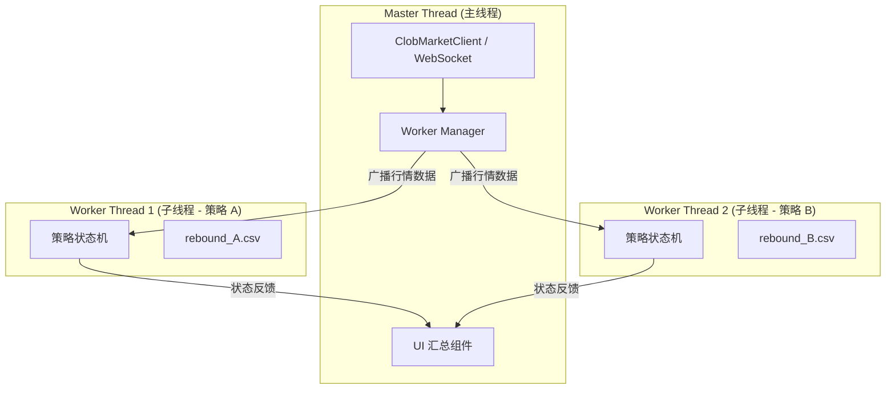

# Polymarket 多线程架构设计方案 (Worker Threads)

本方案旨在通过 Node.js `worker_threads` 模块，将行情监控与策略执行解耦，实现多参数并行测试与高稳定性运行。

## 1. 系统架构图



---

## 2. 角色职责定义

### **主线程 (Master Thread)**
*   **连接管理**：维护唯一的 WebSocket 连接，订阅 BTC/ETH/SOL/XRP 价格。
*   **线程调度**：读取配置文件，为每个配置实例启动一个独立的 Worker。
*   **数据分发**：接收到行情更新后，精准分发给对应的子线程（例如：BTC 价格仅分发给监控 BTC 的线程）。
*   **UI 汇总**：收集所有 Worker 的实时状态（盈亏、交易次数、当前阶段），统一渲染终端界面。

### *   **子线程 (Worker Thread)**：
    *   **独立运行**：拥有独立的内存和事件循环，执行 [STRATEGY_DESIGN.md](STRATEGY_DESIGN.md) 中定义的完整状态机逻辑。
    *   **参数隔离**：根据启动时传入的 `window/drop/tp/sl` 运行，互不干扰。
    *   **本地存储**：每个 Worker 拥有独立的输出文件名，直接进行文件 I/O，并记录价格对应的 **Size** 深度数据。

---

## 3. 配置模式设计 (instances.json)

支持通过 JSON 文件定义多个并行实例：

```json
[
  {
    "id": "BTC-Aggressive",
    "asset": "BTC",
    "params": { "window": 10, "drop": 0.05, "tp": 0.10, "sl": 0.04 },
    "output": "rebound_btc_agg.csv"
  },
  {
    "id": "BTC-Stable",
    "asset": "BTC",
    "params": { "window": 15, "drop": 0.08, "tp": 0.05, "sl": 0.05 },
    "output": "rebound_btc_std.csv"
  }
]
```

---

## 4. 线程间通信协议 (IPC)

使用 `worker.postMessage()` 和 `parentPort.postMessage()` 进行通信：

*   **Master -> Worker**:
    *   `type: 'TICK'`: 发送最新价格 `{ asset, price, ts }`。
    *   `type: 'STOP'`: 优雅关闭线程。
*   **Worker -> Master**:
    *   `type: 'STATUS'`: 反馈当前状态 `{ phase, lastTrade, totalTp, totalSl }`。
    *   `type: 'LOG'`: 关键日志记录请求。

---

## 5. 异常处理与容错

*   **Worker 崩溃隔离**：如果某个 Worker 因逻辑错误退出，主线程捕获 `error` 事件并记录，不影响其他 Worker。
*   **自动重启**：主线程可配置是否在 Worker 异常退出后自动拉起（保持相同参数）。
*   **优雅关闭**：接收到系统 `SIGINT` 时，主线程通知所有 Worker 完成当前 I/O 后退出。

---

## 6. 优势总结

1.  **数据隔离**：不同参数的结果保存在不同 CSV，方便对比分析。
2.  **性能卓越**：利用多核 CPU 处理多个策略计算，WebSocket 响应更及时。
3.  **开发灵活**：修改某个策略逻辑只需针对 Worker 脚本，主线程框架保持稳定。
